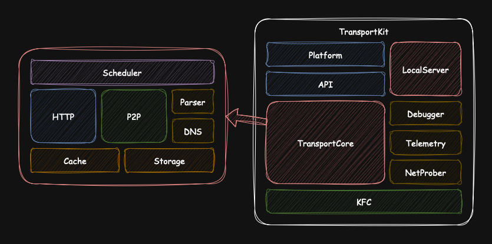

# TransportKit

TransportKit provides peer-to-peer data transfer.

> The project is still being early developed, do not use it for any purpose whatsoever.
>

## Architecture



## Develop

TransportKit uses [CMake](https://cmake.org) to generate building configurations on different platforms.

### CLion (Preferred)

Open the project directory and that's it.

### VSCode

Open the project directory with VSCode, and you'll need at least these plugins:

- [Clangd](https://marketplace.visualstudio.com/items?itemName=llvm-vs-code-extensions.vscode-clangd)
- [CMake Tools](https://marketplace.visualstudio.com/items?itemName=ms-vscode.cmake-tools)

### Xcode

Run the command below to generate project configurations for Xcode.

```bash
cmake -G Xcode -B build-xcode .
```

And then use Xcode to open the generated file named `build-xcode/TransportKit.xcodeproj`. You have to re-run the command
instead of editing Xcode's config file manually every time you make file changes to the project.

## Code Style

The project basically follows [LLVM C++ Style Guide](https://llvm.org/docs/CodingStandards.html), along with some of my
personal coding preferences.

## Credits

Projects and tools that help write TransportKit:

- https://github.com/webkit/webkit
- https://github.com/capnproto/capnproto
- https://github.com/curl/curl
- https://webrtc.googlesource.com
- https://copilot.tencent.com

## License

TransportKit is MIT Licensed.
